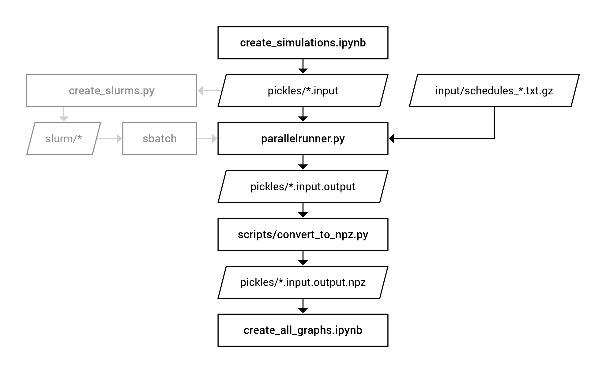

# Architecture

This document provides a high-level overview of architecture of the code and tools in this repository.

## 1) Folder structure

- **docs/:** Documentation including this document and a walk-through guide.
- **input/:** Contains the schedules for online/offline patterns.
- **output/:** Contains the generated graphs and plots (both .png and .pdf).
- **pickles/:** Contains the serialized simulation configurations `*.input`, the simulation results `*.output`, and numpy arays `*.npz`.
- **scripts/:** Helper scripts including those for creating and running the Docker images.
- **simulation/:** The implementation of the MixNet simulator in Python.
- **slurm/:** Destination for slurm files.
- **tests/:** Tests for the MixNet simulator implementation.
- **./create_all_graphs.ipynb:** Python notebook for creating graphs from the simulation results.
- **./create_simulations.ipynb:** Python notebook for creating simulation configurations.
- **./parallelrunner.py:** Main simulator CLI entry point.

## 2) Simulator workflow

This section explains the high-level workflow when using the simulator.

First, the Jupyter Notebook file `create_simulations.ipynb` is used for creating the simulation configurations.
Its current state specifies the configurations that have been run for the paper.
They are roughly separated into different cells for the different figures in the main part of the paper.
The resulting files (e.g. `sim_m256_gs256_rs_gen_os15_rollercoaster-k2-p2-notimeout.input`) are named based on the simulation configuration parameters such as: total size, size of each group, multicast algorithm used, and others.
The simulator stores the configuration in files using Pythons built-in serialization framework "pickle".

The configuration are based on the following parameters:
 - Total user number `m` (typically: 2-256)
 - Per-group size `gs` (typically: 2-256)
 - The simulated time span in milliseconds (typically: 24h)
 - The granularity of the simulation in milliseconds (typically: 10ms)
 - The online-offline schedules
 - The multicast algorithm including parameters
 - The Loopix configuration parameters (typically: \lambda = 6/s)
 - The "app" configuration parameters (i.e. group communication patterns)

Second, the simulations are executed using the `parallelrunner.py` CLI tool.
It expects all created configurations as arguments and instantiates one process for each CPU cores.
Afterwards it uses the pickle framework again for storing the results to disk (`sim_m256_gs256_rs_gen_os15_rollercoaster-k2-p2-notimeout.input.output`).
Since loading large pickle files for analysis requires a lot of RAM, we convert them to compressed numpy arrays (`*.npz`) beforehand.

Finally, the Jupyter Notebook file `create_all_graphs.ipynb` processes the `*.npz` files and creates the figures from the paper using matplotlib.

## 3) Python Code

This section explains how the Python code is organized and points to interesting files.

The entire simulator implementation can be found within `simulation/` with the respective test files in `tests/`.
In general the test files are named similar to the file under test.
All tests can be run with the script `./scripts/coverage.sh` which also outputs the overall coverage (about 90%).

Every simulation consists of one root `Simulation` object which will maintain a list of all `SimulationObjects` that are part of it (see `simulation.py`).
When the simulation is run, the `tick()` method will be called on the root object which then calls `tick()` on its children.
Such children may be mix nodes, users, and providers.
These Loopix actors are implemented within `loopix.py`.
I suggest to have a look at the `User` class to see how the online-offline schedule affects the behavior.

The entire simulation is made deterministic by using a PRNG with a fixed seed.
This is done in `simrandom.py`.
The `poisson_event()` method is called very often by the Loopix design.

The communication behavior between users is modelled in the `apps.py` file.
The `InteractiveApp` class describes how users in a group decide when to send a message to each other.

The actual multicast strategies (Unicast and Rollerocaster) are implemented within the `multicast/` sub package.
The `unicast.py` file is basically stateless while the `rollercoaster.py` implementation comes with many helper classes (e.g. `MessagingSession`) to allow better encapsulating of the state.
The main schedule generating algorithm from the paper is implemented in `Schedule#_gen_schedule` in `schedule.py`.

The `notebook_utils` file is referenced by the Jupyter notebooks and provides helper methods for easier creation of simulations.
It also describes the mapping between parameters and file names.

## 4) Misc

This section explains further technical details that are hard to extract from the code

### 4.1) Schedule files

The schedule files `input/*.txt.gz` consist of a GZipped text file with a line for each client.
Each line consists of a character for every second in a day.
The character is `0` for every second when a client is offline and `1` for when a client is online.

The schedule files `schedules_gen_*` have been computed using the procedures described in the paper from a large (10+ GiB) dataset that was part of the DeviceAnalyzer project.
Unfortunately, it is not practical to include the raw dataset with this artefact.
